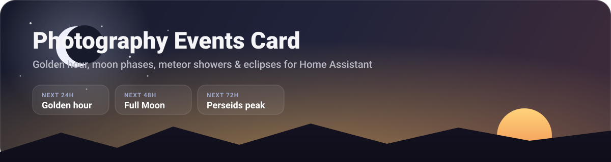

# Photography Events Card



A Home Assistant Lovelace card that looks out from your location (or an
overridden one) for photography-worthy sky and nature events: golden and blue
hour, moon phases, planets and their conjunctions, meteor shower peaks, solar
and lunar eclipses, Milky Way windows, comets you add as they are announced,
and a coarse bird migration season heuristic.

Its main job is to tell an ordinary sunset apart from the rare one where the
whole sky catches fire, and to say so loudly enough to get you out of the
house - see [Scoring the sky](#scoring-the-sky).

> The banner above is an illustration of the card's layout, not a screenshot.

It shows a near-term **24/48/72 hour** snapshot plus a longer **7-30 day**
outlook (21 days by default) in one scrollable timeline, grouped by day.

## What this card computes

- **Golden hour, blue hour, sunrise, and sunset** - computed directly, not read
  from `sun.sun`, so twilight and golden/blue hour boundaries are all available,
  each scored for how likely the sky is to actually light up (see
  [Scoring the sky](#scoring-the-sky))
- **Moon phase, illumination %, moonrise/moonset** - with New Moon ("dark sky,
  good for stars") and Full Moon ("moonrise-over-the-landscape", flagged as a
  Supermoon when notably close) called out specifically
- **Planets** - Mercury, Venus, Mars, Jupiter and Saturn, surfacing oppositions,
  greatest elongations, planet-planet and Moon-planet conjunctions, and a
  nightly "what's up" summary. Positions are computed, not tabulated
- **Meteor shower peaks** - the eleven major annual showers, scored by radiant
  altitude and moonlight interference on the peak night
- **Solar and lunar eclipses** - a curated table of upcoming eclipses (see
  [Data accuracy](#data-accuracy-and-limitations) below) with a local-visibility
  check computed from real moon/sun geometry for your location
- **Milky Way core season** - runs of dark, moonless nights when the galactic
  core clears a usable altitude, grouped into a window naming the best night
- **Comets and anything else announced rather than predicted** - via
  [`custom_events`](#comets-and-other-one-off-events)
- **Bird migration season** - a general spring/fall seasonal window for your
  hemisphere (see the caveat below - this is not live migration data)

Sky-quality scoring needs a `weather_entity` with a cloud-coverage forecast
(see Configuration). Without one, the card still shows every event, just
without a score.

## Scoring the sky

Most sunsets are pleasant. A few times a year the cloud is exactly right and
the whole sky goes up in colour. This card tries to tell those apart rather
than reporting "sunset: 7:14pm" every night.

Vivid sunsets need the low sun's light to reach cloud from underneath without
first crossing the hazy air near the ground, and they need mid- or high-level
cloud up there to catch it (NOAA's Storm Prediction Center has a good write-up
in "The Colors of Twilight and Sunset"). So the ingredients are: a clear path
to the horizon, **broken** rather than flat cloud, no rain-bearing deck, and
clean air - haze and smoke mute colour rather than enhancing it, contrary to
the popular belief.

Almost every Home Assistant weather integration reports a single aggregate
cloud percentage rather than per-layer cloud, so the card infers structure from
how much that number *moves* across the hours either side of the event:

| Signal | Effect |
| --- | --- |
| Mean cloud cover in the broken sweet spot (~25-65%) | Best base score; empty and overcast skies both score low |
| Large spread across the sampled hours | Bonus - broken, dynamic cloud is what catches light |
| Flat, unchanging cloud | Penalty - a uniform deck rarely lights up |
| High precipitation probability | Penalty - rain-bearing low cloud blocks the show |
| Unsettled earlier, clearing by sunset | Bonus - the classic "sky on fire" setup |
| Very high humidity | Penalty - haze mutes saturation |

Scores land in five tiers. The top one, **epic**, needs several signals to line
up at once, gets its own alert banner at the top of the card, and is meant to
be rare - if it fired every week it would not be worth acting on. Each score
also shows its reasoning ("47% cloud, clearing after an unsettled afternoon"),
so you can start recognising the pattern yourself.

## Get notified when the sky is worth chasing

A Lovelace card only tells you something while you are looking at a dashboard,
which is no use for a sky that peaks for fifteen minutes. Custom cards cannot
publish state back into Home Assistant, so the notification has to be a normal
automation reading your weather entity directly. This one mirrors the card's
core heuristic in a deliberately simpler form - moderate, broken cloud with low
rain chance - and fires a couple of hours before sunset:

```yaml
automation:
  - alias: Sunset could be worth chasing
    trigger:
      - platform: sun
        event: sunset
        offset: "-02:00:00"
    condition:
      - condition: template
        value_template: >-
          
          
          
          {{ near | length > 1
             and 25 <= (near | sum / near | length) <= 70
             and (near | max) - (near | min) >= 20
             and (rain | length == 0 or (rain | max) < 40) }}
    action:
      - service: notify.mobile_app_your_phone
        data:
          title: Get to the beach
          message: >-
            Broken cloud and low rain chance into sunset - this one could go off.
```

Replace `weather.home` and `notify.mobile_app_your_phone` with your own
entities. Some integrations expose the hourly forecast through the
`weather.get_forecasts` action rather than a `forecast` attribute; if the
template comes back empty, fetch it in the automation with that action first.

This is intentionally a rough approximation - it cannot see the clearing-trend
or haze signals the card weighs. If you would rather have the card's exact
scoring available to automations, that needs a companion Home Assistant
integration publishing real sensor entities, which is a much larger piece of
work than a dashboard card; say the word and it can be built.

## Requirements

1. Home Assistant 2024.6 or newer (for the `weather/get_forecasts` websocket
   command used for optional sky-quality scoring)
2. HACS
3. Nothing else - no external API keys, no companion integration

The card does not store credentials and does not call any external service.
The only network request it makes is to your own Home Assistant instance
(the `weather/get_forecasts` websocket command, and only if you configure a
`weather_entity`).

## Install with HACS

1. Open **HACS**
2. Open the three-dot menu and choose **Custom repositories**
3. Add `https://github.com/Tmatz27/Home-assistant-photography-events`
4. Choose the **Dashboard** category
5. Install **Photography Events Card**
6. Refresh the browser

## Add the card

Use the dashboard visual editor and choose **Photography Events Card**, or add:

```yaml
type: custom:photography-events-card
```

### The card is not in the "Add card" list

Work through these in order. Step 1 tells you which half of the problem you have.

**1. Did the file load?** Open the browser console (F12 → Console) on a
dashboard page and look for the version banner:

```
Photography Events Card v0.2.0
```

- **Banner present** → the card is registered. Skip to step 4.
- **Banner missing** → the browser never ran the file. Continue with step 2.

**2. Is the resource registered?** Go to **Settings → Dashboards → ⋮ (top
right) → Resources**. You need an entry of type **JavaScript Module**:

```
/hacsfiles/Home-assistant-photography-events/photography-events-card.js
```

If it is missing, add it with **+ Add Resource** using exactly that URL and the
**JavaScript Module** type. HACS adds this automatically only for
storage-mode dashboards.

**3. Running Lovelace in YAML mode?** HACS cannot register the resource for
you. Add it to `configuration.yaml` and restart:

```yaml
lovelace:
  mode: yaml
  resources:
    - url: /hacsfiles/Home-assistant-photography-events/photography-events-card.js
      type: module
```

**4. Clear the frontend cache.** The dashboard caches resources aggressively:

- Desktop: hard refresh with `Ctrl+Shift+R` (`Cmd+Shift+R` on macOS)
- Mobile app: **Settings → Companion App → Debugging → Reset frontend cache**,
  then fully close and reopen the app

**5. Search rather than scroll.** In the card picker, type `Photography` in
the search box. Custom cards are grouped near the bottom of the list, below
every built-in card, so they are easy to miss when scrolling.

If the console shows an error mentioning `photography-events-card` instead of
the version banner, please open an issue with that message.

## Configuration

Every setting is available in the visual editor.

```yaml
type: custom:photography-events-card
title: Photography Events
location_name: Home
weather_entity: weather.home
outlook_days: 21
show_sun_events: true
show_moon_events: true
show_meteor_showers: true
show_eclipses: true
show_milky_way: true
show_bird_migration: true
```

| Option | Default | Description |
| --- | --- | --- |
| `title` | `Photography Events` | Card header text |
| `location_name` | *(none)* | Optional label shown under the title |
| `latitude` / `longitude` | *(your HA location)* | Override the observing point - see below |
| `elevation` | *(your HA elevation)* | Meters; refines rise/set for a horizon dip |
| `weather_entity` | *(none)* | A `weather.*` entity with forecast cloud coverage, used to score sunset/sunrise/meteor-shower conditions |
| `outlook_days` | `21` | How far ahead to look, from 7 to 30 days. The 24/48/72 hour snapshot always shows regardless of this setting |
| `show_sun_events` | `true` | Golden/blue hour, sunrise/sunset |
| `show_moon_events` | `true` | Moon phase, moonrise/moonset |
| `show_planets` | `true` | Oppositions, elongations, conjunctions, nightly planet summary |
| `show_meteor_showers` | `true` | Meteor shower peaks |
| `show_eclipses` | `true` | Solar/lunar eclipses |
| `show_milky_way` | `true` | Milky Way core windows |
| `show_bird_migration` | `true` | Bird migration season banner |
| `custom_events` | `[]` | Comets and other one-off targets - see below |

### Comets and other one-off events

Meteor showers recur every year and eclipses are computed centuries ahead, but
a bright comet is usually only known to be worth chasing a few months out. A
hardcoded comet list would be stale or wrong more often than right, so instead
you add one when it is announced and the card runs it through the same
visibility and moonlight scoring as everything else - how high it gets during
true darkness, and whether the Moon will wash it out:

```yaml
custom_events:
  - name: Comet C/2026 X1
    ra_deg: 250.4
    dec_deg: 20.1
    start: 2026-10-01
    end: 2026-11-15
    note: Expected around magnitude 4 near perihelion.
```

`name`, `ra_deg` and `dec_deg` are required (right ascension and declination in
degrees, as published in any comet ephemeris); `start`, `end` and `note` are
optional. Entries missing coordinates are skipped rather than breaking the
card. Coordinates are treated as fixed, which is fine over a week or two of a
slow-moving comet - for a fast one, update the entry as it moves.

### Why there's no "search within a 30 minute drive"

Every event type this card computes - golden hour, moon phases, meteor
showers, eclipse visibility - is essentially identical across a 30 minute
driving radius; astronomy doesn't change much over a few tens of kilometers.
What *does* change over that radius is which specific spot has a clear view
(an unobstructed ocean horizon, a dark sky away from streetlights), and that's
local geography this card can't know on its own.

Today, the `latitude`/`longitude`/`elevation` overrides are the tool for that:
point the card at your favorite nearby overlook instead of your house.
Letting you name and switch between several saved locations (e.g. for an
upcoming trip) is a natural next step but is intentionally not built yet -
tracked as a future enhancement.

## Data accuracy and limitations

- **Sun/moon positions are computed locally** with well-known low-precision
  formulas (the same family described on public references like aa.quae.nl's
  "Position of the Sun/Moon" pages), not read from an external ephemeris
  service. Expect rise/set and twilight times to be accurate to within a
  minute or two - reliable enough for planning a shoot, not survey-grade
- **Planet positions are computed** from mean Keplerian elements with a
  two-body solver, accurate to a few arcminutes - far finer than needed to say
  where to point a camera. As a check, it reproduces published opposition dates
  (Mars 2027-02-19, Jupiter 2026-01-10 and 2027-02-11, Saturn 2026-10-04) to
  the exact day
- **Sky-quality scoring is a heuristic, not a forecast model.** It is inferring
  cloud structure from a single aggregate percentage, so it will miss things a
  layered cloud model would catch. Treat "epic" as "worth looking outside",
  not a guarantee
- **Meteor shower peak dates recur annually** and are hardcoded to their
  well-known average calendar date, which can drift by about a day year to
  year
- **The eclipse table is a manually curated, static list** (compiled from
  NASA/Wikipedia/EclipseWise eclipse predictions) covering upcoming eclipses
  into 2028. It needs periodic updates for eclipses further out, and you
  should verify exact timing and, for solar eclipses, whether your specific
  location falls in the path, against an authoritative source before making
  travel plans. Lunar eclipse visibility is a real computed check (is the
  Moon above your horizon); solar eclipse visibility only rules out the
  night side of Earth - it cannot tell you whether you're inside the actual
  path of totality/annularity
- **Bird migration is a coarse seasonal heuristic** (a general spring/fall
  date range for your hemisphere), not live migration data. For real-time
  nocturnal migration intensity, check Cornell Lab's BirdCast

## Privacy and security

- **No telemetry, no third-party requests.** All astronomy is computed in the
  browser. The only network activity is the `weather/get_forecasts` websocket
  call to your own Home Assistant instance, and only if you configure
  `weather_entity`
- **No credentials of any kind** are stored or required
- Card-editor text inputs are escaped before rendering
- **No inline event handlers**, which keeps the card compatible with strict
  Content-Security-Policy setups

## Development

```bash
npm test
```

No build step is required. `photography-events-card.js` is the HACS release
file.

## Credits

Sun/moon position formulas follow well-known low-precision astronomical
algorithms described publicly on references such as aa.quae.nl - not copied
from any single library, but the same standard, widely-implemented math.

## License

MIT
